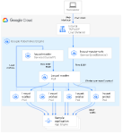

## Distribute Load Testing Using GKE

## Introduction
主要介绍如何使用 Google Kubernetes Engine (GKE) 部署分布式负载测试框架，该框架使用多个容器为简单的基于 REST 的 API 创建流量。在本教程中，我对一个已经部署到 GCP 的应用执行负载测试，该应用支持 HTTP 请求。

您可以使用与此同样的模式为各种场景和应用创建负载测试框架，如消息传递系统、数据流管理系统和数据库系统。

## Load testing tasks
主要涉及到两个主要组件：

- Locust Docker 容器映像
- 容器编排和管理机制

Locust Docker container image 包含 Locust 软件。在克隆本 GitHub 代码库时获得的 Dockerfile 使用的是基本 Python image，并且包含用于启动 Locust 服务和执行任务的脚本。

GKE 提供容器编排和管理功能。使用 GKE，可以指定为负载测试框架奠定基础的容器节点的数量。此外，还可以将负载测试工作器组织到 pod 中，并指定希望 GKE 持续运行的 pod 数量。

为了部署负载测试任务，请执行以下操作：

- 部署负载测试 master 节点
- 部署一组负载测试 worker 节点，使用这些 worker 创建大量的流量执行测试。
下图展示了使用示例应用进行负载测试的架构。master pod 提供用于操作和监控负载测试的网页界面。worker pod 为接受测试的应用生成 REST 请求流量，并将指标发送到 master pod



## Load testing master

部署的第一个组件是 Locust master，它是执行负载测试任务的入口点。 Locust master 部署了一个副本，因为我们只需要一个 master。

master deployment 指定了几个元素，包括 container 需要暴露的端口（8089 用于 Web 界面，5557 和 5558 用于与 worker 通信）。以下代码段包含端口的配置：

    ports:
       - name: loc-master-web
         containerPort: 8089
         protocol: TCP
       - name: loc-master-p1
         containerPort: 5557
         protocol: TCP
       - name: loc-master-p2
         containerPort: 5558
         protocol: TCP

接下来，将部署一个 `Service`，以确保其他 pod 可以通过集群中的 `hostname:port` 访问暴露的端口，并且可以通过描述性端口名称进行引用。 服务的使用允许 Locust worker 轻松发现并可靠地与 master 通信，即使 master 发生故障并被部署替换为新的 pod。 Locust master 还包括在集群级别（即 LoadBalancer 的类型）创建外部转发规则的指令，该指令提供外部流量访问集群资源的能力。

部署 Locust 主服务器后，您可以使用 public IP address 地址访问 Web 界面。 部署 Locust worker 后，您可以开始模拟并通过 Locust Web 界面查看汇总统计信息。
## Load testing workers

部署的下一个组件包括执行上述负载测试任务的 Locust worker。 Locust worker 由一个 `deployment` 创建多个 pod。 Pod 分布在 Kubernetes 集群中。 每个 pod 使用环境变量来控制重要的配置信息，例如被测系统的 hostname 和 Locust master hostname。

Locust worker 部署完成后，可以返回 Locust master web 界面，看到 `WORKERS` 的数量对应于部署的 worker 的数量。

## 初始化通用变量

1. 打开 Cloud Shell
通过 Cloud Shell 运行该教程中的所有终端命令。

2. 设置需要自定义的环境变量：


    export GKE_CLUSTER=GKE_CLUSTER
    export AR_REPO=AR_REPO
    export REGION=REGION
    export ZONE=ZONE
    export SAMPLE_APP_LOCATION=SAMPLE_APP_LOCATION

替换以下内容：

- GKE_CLUSTER：GKE 集群的名称
- AR_REPO：Artifact Registry 代码库的名称
- REGION：将在其中创建 GKE 集群和 Artifact Registry 代码库的区域
- ZONE：将在其中创建 Compute Engine 实例的您所在区域中的可用区
- SAMPLE_APP_LOCATION：将在其中部署您应用的（区域）位置，如无需部署则忽略

这些命令应类似于以下示例：

    export GKE_CLUSTER=cluster-1
    export AR_REPO=my-repo
    export REGION=us-west1
    export ZONE=us-west1-b
    export SAMPLE_APP_LOCATION=us-west1-b

**Note:** Following services should be enabled in your project:
Cloud Build Kubernetes Engine Google App Engine Admin API Cloud Storage

    $ gcloud services enable \
        cloudbuild.googleapis.com \
        compute.googleapis.com \
        container.googleapis.com \
        containeranalysis.googleapis.com \
        containerregistry.googleapis.com 

3. 设置以下其他环境变量：
```
export GKE_VERSION=1.20
export GKE_NODE_TYPE=e2-standard-4
export GKE_SCOPE="https://www.googleapis.com/auth/cloud-platform"
export PROJECT=$(gcloud config get-value project)
export SAMPLE_APP_TARGET=random-1m-768-0d908f2.svc.us-west1-gcp.pinecone.io/query
```
**Note:** 若 `gcloud config get-value project` 为空则先通过命令 `gcloud config set project $PROJECT_ID` 设置默认 project

4. 设置默认可用区，这样您就不必在后续命令中指定这些值：
```
gcloud config set compute/zone $ZONE
gcloud config set compute/region $REGION 
```

## 创建 GKE 集群

1. 创建 GKE 集群

**Note:** 如果通过其他方式创建 GKE cluster (如 Console) 则忽略该步骤

   ```
  gcloud container clusters create ${GKE_CLUSTER} \
       --region ${REGION} \
       --cluster-version ${GKE_VERSION} \
       --machine-type ${GKE_NODE_TYPE} \
       --enable-autoscaling \
       --num-nodes 3 \
       --min-nodes 1 \
       --max-nodes 6 \
       --scopes "${GKE_SCOPE}"
   ```

2. 连接到 GKE 集群：
```angular2html
gcloud container clusters get-credentials $CLUSTER --region $REGION --project $PROJECT
```

## 设置环境
1. 从 GitHub 克隆示例代码库：
```angular2html
git clone https://github.com/ThreadDao/distributed-load-testing-using-kubernetes.git
```

2. 将工作目录更改为克隆的代码库：
```angular2html
cd distributed-load-testing-using-kubernetes
```

## 构建 container image
1. 创建 Artifact Registry 代码库：
```
gcloud artifacts repositories create ${AR_REPO} \
    --repository-format=docker  \
    --location=${REGION} \
    --description="Distributed load testing with GKE and Locust"
```

2. 构建 container image 并将其存储在 Artifact Registry 代码库中：
**Note:** 多次构建 image 时也可以自行更换 tag
```
export LOCUST_IMAGE_NAME=locust-tasks
export LOCUST_IMAGE_TAG=latest
gcloud builds submit \
    --tag ${REGION}-docker.pkg.dev/${PROJECT}/${AR_REPO}/${LOCUST_IMAGE_NAME}:${LOCUST_IMAGE_TAG} \
    docker-image
```

3. 验证 image 是否在 Artifact Registry 代码库中：
```
gcloud artifacts docker images list ${REGION}-docker.pkg.dev/${PROJECT}/${AR_REPO} |grep ${LOCUST_IMAGE_NAME}
```

## 部署应用
此处省略应用部署示例，请自行完成您的应用部署

## 部署 Locust master Pod 和 worker Pod
1. 替换部署 yaml 中的环境变量值 

将 `locust-master-controller.yaml` 和 `locust-worker-controller.yaml` 文件中的 `TARGET_HOST`、`PROJECT`、`REGION`、`AR_REPO`、`LOCUST_IMAGE_NAME`、`LOCUST_IMAGE_TAG`、`WORKER_REPLICAS` 替换为环境变量值，
   并创建 Locust master Pod 和 worker Pod Deployment：
**Note:** 替换方式多样，可自行选择
```
envsubst < kubernetes-config/locust-master-controller.yaml | kubectl apply -f -
envsubst < kubernetes-config/locust-worker-controller.yaml | kubectl apply -f -
envsubst < kubernetes-config/locust-master-service.yaml | kubectl apply -f -
```

2. 验证 Locust Deployment 和 Service:
```
kubectl get pods -o wide
kubectl get services
```

3. 获取 locust-master svc 的 EXTERNAL-IP

```
kubectl get svc
```
输出结果类似以下所示：
```
NAME            TYPE           CLUSTER-IP     EXTERNAL-IP     PORT(S)                                        AGE
kubernetes      ClusterIP      10.88.0.1      <none>          443/TCP                                        4h58m
locust-master   LoadBalancer   10.88.15.120   34.168.68.158   8089:32385/TCP,5557:31633/TCP,5558:30882/TCP   175m
```

## 在您应用上运行 locust 测试
在浏览器打开 http://$EXTERNAL_IP:8089 访问 locust web，指定 `Number of users` 和 `Spawn rate` 开始负载测试
过多 locust 使用细节此处不做说明，请移步 locust 官网

## 动态扩容 worker
扩大模拟用户的数量将需要增加 Locust worker pod 的数量，Kubernetes 提供了无需重新部署即可调整 `deployment` 大小的能力。 例如，以下命令将 Locust worker pod 扩展到 20 个：
```
kubectl scale deployment/locust-worker --replicas=20
```

## 删除集群
使用后记得删除集群，清理在 GCP 上创建的资源，避免日后再为这些资源付费
```
gcloud container clusters delete $CLUSTER --zone $ZONE
```

## License

This code is Apache 2.0 licensed and more information can be found in `LICENSE`. For information on licenses for third party software and libraries, refer to the `docker-image/licenses` directory.

## Reference
https://cloud.google.com/architecture/distributed-load-testing-using-gke

